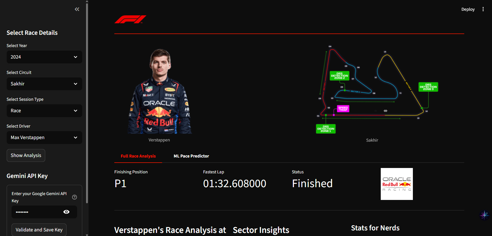

# F1 Lap Time Prediction & Analysis Dashboard

 

A multi-year Formula 1 dashboard that provides in-depth analysis of driver performance, race strategy, and includes a live, machine-learning-powered lap time predictor.

**Live App Link:** [Link to your deployed Streamlit app will go here]

---

## Features

* **Driver Deep-Dive Page:**
    * **Dynamic Data Loading:** Select any driver, circuit, and session from the **2018-2024** seasons.
    * **Key Metrics:** Instantly view a driver's finishing position, fastest lap, and race status.
    * **AI-Powered Narrative:** A text-based summary of the driver's fastest lap and key sector performance.
    * **Tyre Strategy Visualization:** A Gantt-style chart showing every stint, the compound used, and its duration.
    * **Fastest Lap Telemetry:** Interactive Plotly charts visualizing the driver's Speed, Throttle, Brake, RPM, and Gear usage for their fastest lap.

* **ML Pace Predictor Tab:**
    * **Interactive Simulation:** Use sliders and dropdowns to set up a "what-if" scenario by choosing the lap number, tyre compound, tyre age, stint, and weather conditions.
    * **Live Predictions:** Uses a pre-trained, circuit-specific machine learning model (XGBoost or LightGBM) to predict the lap time for the selected scenario.
    * **AI Commentator:** Leverages the **Google Gemini API** to generate a fun, witty, broadcast-style commentary on the predicted lap time.

## Tech Stack

* **Language:** Python
* **Data & Analysis:** Pandas, NumPy, Scikit-learn
* **F1 Data Source:** FastF1
* **Machine Learning:** XGBoost, LightGBM, Joblib
* **Generative AI:** Google Gemini API
* **Dashboard & Visualization:** Streamlit, Plotly
* **Deployment:** Streamlit Community Cloud (or your chosen platform)

---

## Local Setup & Installation

1.  **Clone the repository:**
    ```bash
    git clone [https://github.com/YourUsername/YourRepoName.git](https://github.com/YourUsername/YourRepoName.git)
    cd YourRepoName
    ```

2.  **Set up a virtual environment (Recommended):**
    ```bash
    python -m venv venv
    source venv/bin/activate  # On Windows, use `venv\Scripts\activate`
    ```

3.  **Install dependencies:**
    ```bash
    pip install -r requirements.txt
    ```

4.  **Configure API Keys:**
    * Create a file at `.streamlit/secrets.toml`.
    * Add your Gemini API key to this file:
        ```toml
        GEMINI_API_KEY = "YOUR_API_KEY_HERE"
        ```

5.  **Run the Streamlit App:**
    ```bash
    streamlit run 1_Driver_Deep-Dive.py
    ```